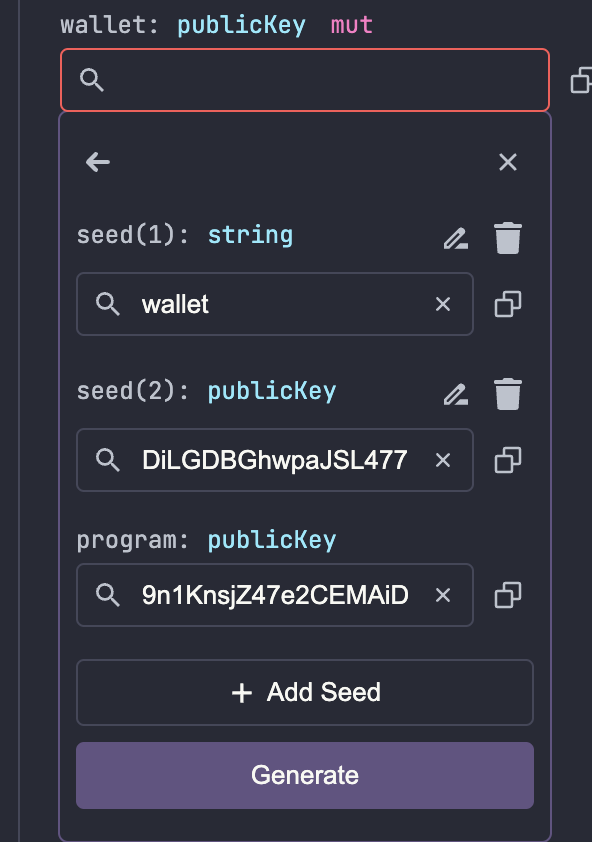

# Time-Locked Wallet - Solana Playground Example

A Solana program that demonstrates how to create a time-locked wallet for SOL, built with Anchor framework and testable in Solana Playground.

## Program Features

- 🔒 Create time-locked wallets
- 💰 Multiple SOL deposits
- ⏰ Time-based withdrawals
- 🏦 Rent-exempt balance handling
- 🧹 Account cleanup

## Try it in Solana Playground

### 1. Setup

1. Visit [Solana Playground](https://beta.solpg.io)
2. Create a new project
3. Copy the program code

### 2. Create and connect a Wallet

1. Click on the left corner and create and connect your wallet.
2. Switch to devnet cluster if needed.

### 3. Build the program using the build button

### 4. Deploy the program using the build button

### 5. Testing the initialize of the wallet

1. We need to build the wallet PDA from seed using 3 components:

   

   - Seed string that we used in our code "wallet"

     

   - The owner public key

     

   - The program ID - (automatically passed)

     

2. We can test our initialize wallet function with pressing the test button.

   

### 6. Deposit SOL

1. We can deposit 0.1 SOL. Please note that we are using lampports.
2. We can press the test button:

   

### 7. Withdraw SOL

1. We can withdraw the SOL amount similarly as we deposited it.
2. The wallet ID that we need to pass it the same PDA that we've derived in step 5:

   

### 8. Close Wallet

1. We can close the account.

   

## Common Issues & Solutions

### 1. "Too Early" Error

- Occurs when trying to withdraw before release time
- Solution: Wait until release time or create new wallet with shorter timelock

### 2. Account Already Exists

- Occurs when creating a wallet that already exists
- Solution: Close existing wallet first or use different address

### 3. Insufficient Balance

- Occurs when lacking SOL for rent or deposit
- Solution: Fund your wallet with devnet SOL

## Complete Testing Flow

1. Create wallet (5-min lock)
2. Deposit 0.1 SOL
3. Try withdraw (fails)
4. Wait 5 minutes
5. Withdraw (succeeds)
6. Close wallet

## Program Architecture

## Need Help?

- 📚 [Solana Cookbook](https://solanacookbook.com)
- 💬 [Solana Stack Exchange](https://solana.stackexchange.com)
- 🤝 [Solana Discord](https://discord.com/invite/solana)
